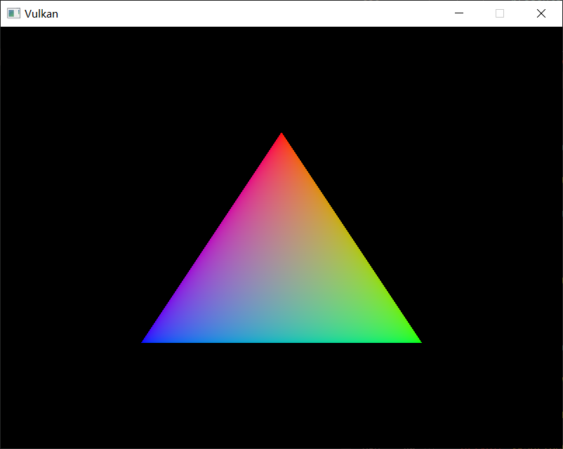

# Rendering and presentation

This is the chapter where everything is going to come together. We're going to write the `drawFrame` function that will be called from the main loop to put the triangle on the screen. Let's start by creating the function and call it from `mainLoop`:

```java
private void mainLoop() {
    while (!glfw.windowShouldClose(window)) {
        glfw.pollEvents();
        drawFrame();
    }
}

// ...

private void drawFrame() {
}
```

## Outline of a frame

At a high level, rendering a frame in Vulkan consists of a common set of steps:

- Wait for the previous frame to finish
- Acquire an image from the swap chain
- Record a command buffer which draws the scene onto that image
- Submit the recorded command buffer
- Present the swap chain image

While we will expand the drawing function in later chapters, for now this is the core of our render loop.

## Synchronization

A core design philosophy in Vulkan is that synchronization of execution on the GPU is explicit. The order of operations is up to us to define using various synchronization primitives which tell the driver the order we want things to run in. This means that many Vulkan API calls which start executing work on the GPU are asynchronous, the functions will return before the operation has finished.

In this chapter there are a number of events that we need to order explicitly because they happen on the GPU, such as:

- Acquire an image from the swap chain
- Execute commands that draw onto the acquired image
- Present that image to the screen for presentation, returning it to the swapchain

Each of these events is set in motion using a single function call, but are all executed asynchronously. The function calls will return before the operations are actually finished and the order of execution is also undefined. That is unfortunate, because each of the operations depends on the previous one finishing. Thus we need to explore which primitives we can use to achieve the desired ordering.

### Semaphores

A semaphore is used to add order between queue operations. Queue operations refer to the work we submit to a queue, either in a command buffer or from within a function as we will see later. Examples of queues are the graphics queue and the presentation queue. Semaphores are used both to order work inside the same queue and between different queues.

There happens to be two kinds of semaphores in Vulkan, binary and timeline. Because only binary semaphores will be used in this tutorial, we will not discuss timeline semaphores. Further mention of the term semaphore exclusively refers to binary semaphores.

A semaphore is either unsignaled or signaled. It begins life as unsignaled. The way we use a semaphore to order queue operations is by providing the same semaphore as a 'signal' semaphore in one queue operation and as a 'wait' semaphore in another queue operation. For example, lets say we have semaphore S and queue operations A and B that we want to execute in order. What we tell Vulkan is that operation A will 'signal' semaphore S when it finishes executing, and operation B will 'wait' on semaphore S before it begins executing. When operation A finishes, semaphore S will be signaled, while operation B won't start until S is signaled. After operation B begins executing, semaphore S is automatically reset back to being unsignaled, allowing it to be used again.

Pseudocode of what was just described:

```c
VkCommandBuffer A, B = ... // record command buffers
VkSemaphore S = ... // create a semaphore

// enqueue A, signal S when done - starts executing immediately
vkQueueSubmit(work: A, signal: S, wait: None)

// enqueue B, wait on S to start
vkQueueSubmit(work: B, signal: None, wait: S)
```

Note that in this code snippet, both calls to `vkQueueSubmit()` return immediately - the waiting only happens on the GPU. The CPU continues running without blocking. To make the CPU wait, we need a different synchronization primitive, which we will now describe.

### Fences

A fence has a similar purpose, in that it is used to synchronize execution, but it is for ordering the execution on the CPU, otherwise known as the host. Simply put, if the host needs to know when the GPU has finished something, we use a fence.

Similar to semaphores, fences are either in a signaled or unsignaled state. Whenever we submit work to execute, we can attach a fence to that work. When the work is finished, the fence will be signaled. Then we can make the host wait for the fence to be signaled, guaranteeing that the work has finished before the host continues.

A concrete example is taking a screenshot. Say we have already done the necessary work on the GPU. Now need to transfer the image from the GPU over to the host and then save the memory to a file. We have command buffer A which executes the transfer and fence F. We submit command buffer A with fence F, then immediately tell the host to wait for F to signal. This causes the host to block until command buffer A finishes execution. Thus we are safe to let the host save the file to disk, as the memory transfer has completed.

Pseudocode for what was described:

```c
VkCommandBuffer A = ... // record command buffer with the transfer
VkFence F = ... // create the fence

// enqueue A, start work immediately, signal F when done
vkQueueSubmit(work: A, fence: F)

vkWaitForFence(F) // blocks execution until A has finished executing

save_screenshot_to_disk() // can't run until the transfer has finished
```

Unlike the semaphore example, this example *does* block host execution. This means the host won't do anything except wait until execution has finished. For this case, we had to make sure the transfer was complete before we could save the screenshot to disk.

In general, it is preferable to not block the host unless necessary. We want to feed the GPU and the host with useful work to do. Waiting on fences to signal is not useful work. Thus we prefer semaphores, or other synchronization primitives not yet covered, to synchronize our work.

Fences must be reset manually to put them back into the unsignaled state. This is because fences are used to control the execution of the host, and so the host gets to decide when to reset the fence. Contrast this to semaphores which are used to order work on the GPU without the host being involved.

In summary, semaphores are used to specify the execution order of operations on the GPU while fences are used to keep the CPU and GPU in sync with each-other.

### What to choose?

We have two synchronization primitives to use and conveniently two places to apply synchronization: Swapchain operations and waiting for the previous frame to finish. We want to use semaphores for swapchain operations because they happen on the GPU, thus we don't want to make the host wait around if we can help it. For waiting on the previous frame to finish, we want to use fences for the opposite reason, because we need the host to wait. This is so we don't draw more than one frame at a time. Because we re-record the command buffer every frame, we cannot record the next frame's work to the command buffer until the current frame has finished executing, as we don't want to overwrite the current contents of the command buffer while the GPU is using it.

## Creating the synchronization objects

We'll need one semaphore to signal that an image has been acquired from the swapchain and is ready for rendering, another one to signal that rendering has finished and presentation can happen, and a fence to make sure only one frame is rendering at a time.

Create three class members to store these semaphore objects and fence object:

```java
private VkSemaphore imageAvailableSemaphore;
private VkSemaphore renderFinishedSemaphore;
private VkFence inFlightFence;
```

To create the semaphores, we'll add the last create function for this part of the tutorial: `createSyncObjects`:

```java
private void initVulkan() {
    // ...
    createSyncObjects();
}

// ...

private void createSyncObjects() {
}
```

Creating semaphores requires filling in the `VkSemaphoreCreateInfo`, but in the current version of the API it doesn't actually have any required fields besides `sType` (which `vulkan4j` wrapper initializes automatically for us):

```java
try (var arena = Arena.ofConfined()) {
    var semaphoreInfo = VkSemaphoreCreateInfo.allocate(arena);
}
```

Future versions of the Vulkan API or extensions may add functionality for the `flags` and `pNext` parameters like it does for the other structures.

Creating a fence requires filling in the `VkFenceCreateInfo`:

```java
var fenceCreateInfo = VkFenceCreateInfo.allocate(arena);
```

Creating the semaphores and fence follows the familiar pattern with `VkDeviceCommands::createSemaphore` & `VkDeviceCommands::createFence`:

```java
try (var arena = Arena.ofConfined()) {
    var semaphoreInfo = VkSemaphoreCreateInfo.allocate(arena);
    var fenceCreateInfo = VkFenceCreateInfo.allocate(arena);

    var pImageAvailableSemaphore = VkSemaphore.Ptr.allocate(arena);
    var pRenderFinishedSemaphore = VkSemaphore.Ptr.allocate(arena);
    var pInFlightFence = VkFence.Ptr.allocate(arena);

    if (deviceCommands.createSemaphore(device, semaphoreInfo, null, pImageAvailableSemaphore) != VkResult.SUCCESS
        || deviceCommands.createSemaphore(device, semaphoreInfo, null, pRenderFinishedSemaphore) != VkResult.SUCCESS
        || deviceCommands.createFence(device, fenceCreateInfo, null, pInFlightFence) != VkResult.SUCCESS) {
        throw new RuntimeException("Failed to create synchronization objects for a frame");
    }

    imageAvailableSemaphore = Objects.requireNonNull(pImageAvailableSemaphore.read());
    renderFinishedSemaphore = Objects.requireNonNull(pRenderFinishedSemaphore.read());
    inFlightFence = Objects.requireNonNull(pInFlightFence.read());
}
```

The semaphores and fence should be cleaned up at the end of the program, when all commands have finished and no more synchronization is necessary:

```java
private void cleanup() {
    deviceCommands.destroySemaphore(device, imageAvailableSemaphore, null);
    deviceCommands.destroySemaphore(device, renderFinishedSemaphore, null);
    deviceCommands.destroyFence(device, inFlightFence, null);
    // ...
}
```

Onto the main drawing function!

## Waiting for the previous frame

At the start of the frame, we want to wait until the previous frame has finished, so that the command buffer and semaphores are available to use. To do that, we call `VkDeviceCommands::waitForFences`:

```java
try (var arena = Arena.ofConfined()) {
    var pInFlightFences = VkFence.Ptr.allocate(arena);
    pInFlightFences.write(inFlightFence);
    deviceCommands.waitForFences(device, 1, pInFlightFences, VkConstants.TRUE, NativeLayout.UINT64_MAX);
}
```

The `VkDeviceCommands::waitForFences` function takes an array of fences and waits on the host for either any or all of the fences to be signaled before returning. The `VkConstants.TRUE` we pass here indicates that we want to wait for all fences, but in the case of a single one it doesn't matter. This function also has a timeout parameter that we set to the maximum value of a 64bit unsigned integer, `NativeLayout.UINT64_MAX`, which effectively disables the timeout.

After waiting, we need to manually reset the fence to the unsignaled state with the `VkDeviceCommands::resetFences` call:

```java
deviceCommands.resetFences(device, 1, pInFlightFences);
```

Before we can proceed, there is a slight hiccup in our design. On the first frame we call `drawFrame()`, which immediately waits on `inFlightFence` to be signaled. `inFlightFence` is only signaled after a frame has finished rendering, yet since this is the first frame, there are no previous frames in which to signal the fence! Thus `vkWaitForFences()` blocks indefinitely, waiting on something which will never happen.

Of the many solutions to this dilemma, there is a clever workaround built into the API. Create the fence in the signaled state, so that the first call to `vkWaitForFences()` returns immediately since the fence is already signaled.

To do this, we add the `VkFenceCreateFlags.SIGNALED` flag to the `VkFenceCreateInfo`:

```java
private void createSyncObjects() {
    // ...

    var fenceCreateInfo = VkFenceCreateInfo.allocate(arena);
    fenceCreateInfo.flags(VkFenceCreateFlags.SIGNALED);

    // ...
}
```

## Acquiring an image from the swap chain

The next thing we need to do in the `drawFrame` function is acquire an image from the swap chain. Recall that the swap chain is an extension feature, so we must use a function with the `*KHR` naming convention:

```java
var pImageIndex = IntPtr.allocate(arena);
deviceCommands.acquireNextImageKHR(
        device,
        swapChain,
        NativeLayout.UINT64_MAX,
        imageAvailableSemaphore,
        null,
        pImageIndex
);
var imageIndex = pImageIndex.read();
```

The next two parameters specify synchronization objects that are to be signaled when the presentation engine is finished using the image. That's the point in time where we can start drawing to it. It is possible to specify a semaphore, fence or both. We're going to use our `imageAvailableSemaphore` for that purpose here.

The last parameter specifies a variable to output the index of the swap chain image that has become available. The index refers to the `VkImage` in our `swapChainImages` array. We're going to use that index to pick the `VkFrameBuffer`.

## Recording the command buffer

With the imageIndex specifying the swap chain image to use in hand, we can now record the command buffer. First, we call `VkDeviceCommands::resetCommandBuffer` on the command buffer to make sure it is able to be recorded.

```java
deviceCommands.resetCommandBuffer(commandBuffer, 0);
```

The second parameter of `VkDeviceCommands::resetCommandBuffer` is a `VkCommandBufferResetFlags` flag. Since we don't want to do anything special, we leave it as 0.

Now call the function `recordCommandBuffer` to record the commands we want.

```java
recordCommandBuffer(commandBuffer, imageIndex);
```

With a fully recorded command buffer, we can now submit it.

## Submitting the command buffer

Queue submission and synchronization is configured through parameters in the `VkSubmitInfo` structure.

```java
deviceCommands.resetCommandBuffer(commandBuffer, 0);
recordCommandBuffer(commandBuffer, imageIndex);
var submitInfo = VkSubmitInfo.allocate(arena);
var pWaitSemaphores = VkSemaphore.Ptr.allocate(arena);
pWaitSemaphores.write(imageAvailableSemaphore);
var pWaitStages = IntPtr.allocate(arena);
pWaitStages.write(VkPipelineStageFlags.COLOR_ATTACHMENT_OUTPUT);
submitInfo.waitSemaphoreCount(1);
submitInfo.pWaitSemaphores(pWaitSemaphores);
submitInfo.pWaitDstStageMask(pWaitStages);
```

The first three fields specify which semaphores to wait on before execution begins and in which stage(s) of the pipeline to wait. We want to wait with writing colors to the image until it's available, so we're specifying the stage of the graphics pipeline that writes to the color attachment. That means that theoretically the implementation can already start executing our vertex shader and such while the image is not yet available. Each entry in the `waitStages` array corresponds to the semaphore with the same index in `pWaitSemaphores`.

```java
var pCommandBuffers = VkCommandBuffer.Ptr.allocate(arena);
pCommandBuffers.write(commandBuffer);
submitInfo.commandBufferCount(1);
submitInfo.pCommandBuffers(pCommandBuffers);
```

The next two fields specify which command buffers to actually submit for execution. We simply submit the single command buffer we have.

```java
var pSignalSemaphores = VkSemaphore.Ptr.allocate(arena);
pSignalSemaphores.write(renderFinishedSemaphore);
submitInfo.signalSemaphoreCount(1);
submitInfo.pSignalSemaphores(pSignalSemaphores);
```

The `signalSemaphoreCount` and `pSignalSemaphores` parameters specify which semaphores to signal once the command buffer(s) have finished execution. In our case we're using the `renderFinishedSemaphore` for that purpose.

```java
var result = deviceCommands.queueSubmit(graphicsQueue, 1, submitInfo, inFlightFence);
if (result != VkResult.SUCCESS) {
    throw new RuntimeException("Failed to submit draw command buffer, vulkan error code: " + VkResult.explain(result));
}
```

We can now submit the command buffer to the graphics queue using `VkDeviceCommands::queueSubmit`. The function takes an array of `VkSubmitInfo` structures as argument for efficiency when the workload is much larger. The last parameter references an optional fence that will be signaled when the command buffers finish execution. This allows us to know when it is safe for the command buffer to be reused, thus we want to give it `inFlightFence`. Now on the next frame, the CPU will wait for this command buffer to finish executing before it records new commands into it.

## Subpass dependencies

Remember that the subpasses in a render pass automatically take care of image layout transitions. These transitions are controlled by subpass dependencies, which specify memory and execution dependencies between subpasses. We have only a single subpass right now, but the operations right before and right after this subpass also count as implicit "subpasses".

There are two built-in dependencies that take care of the transition at the start of the render pass and at the end of the render pass, but the former does not occur at the right time. It assumes that the transition occurs at the start of the pipeline, but we haven't acquired the image yet at that point! There are two ways to deal with this problem. We could change the `waitStages` for the `imageAvailableSemaphore` to `VK_PIPELINE_STAGE_TOP_OF_PIPE_BIT` to ensure that the render passes don't begin until the image is available, or we can make the render pass wait for the `VK_PIPELINE_STAGE_COLOR_ATTACHMENT_OUTPUT_BIT` stage. I've decided to go with the second option here, because it's a good excuse to have a look at subpass dependencies and how they work.

Subpass dependencies are specified in `VkSubpassDependency` structs. Go to the `createRenderPass` function and add one:

```java
var dependency = VkSubpassDependency.allocate(arena);
dependency.srcSubpass(VkConstants.SUBPASS_EXTERNAL);
dependency.dstSubpass(0);
```

The first two fields specify the indices of the dependency and the dependent subpass. The special value `VkConstants.SUBPASS_EXTERNAL` refers to the implicit subpass before or after the render pass depending on whether it is specified in `srcSubpass` or `dstSubpass`. The index `0` refers to our subpass, which is the first and only one. The `dstSubpass` must always be higher than `srcSubpass` to prevent cycles in the dependency graph, unless one of the subpasses is `VkConstants.SUBPASS_EXTERNAL`.

```java
dependency.srcStageMask(VkPipelineStageFlags.COLOR_ATTACHMENT_OUTPUT);
dependency.srcAccessMask(0);
```

The next two fields specify the operations to wait on and the stages in which these operations occur. We need to wait for the swap chain to finish reading from the image before we can access it. This can be accomplished by waiting on the color attachment output stage itself.

```java
dependency.dstStageMask(VkPipelineStageFlags.COLOR_ATTACHMENT_OUTPUT);
dependency.dstAccessMask(VkAccessFlags.COLOR_ATTACHMENT_WRITE);
```

The operations that should wait on this are in the color attachment stage and involve the writing of the color attachment. These settings will prevent the transition from happening until it's actually necessary (and allowed): when we want to start writing colors to it.

```java
renderPassInfo.dependencyCount(1);
renderPassInfo.pDependencies(dependency);
```

The `VkRenderPassCreateInfo` struct has two fields to specify an array of dependencies.

## Presentation

The last step of drawing a frame is submitting the result back to the swap chain to have it eventually show up on the screen. Presentation is configured through a `VkPresentInfoKHR` structure at the end of the `drawFrame` function.

```java
var presentInfo = VkPresentInfoKHR.allocate(arena);
presentInfo.waitSemaphoreCount(1);
presentInfo.pWaitSemaphores(pSignalSemaphores);
```

The first two fields specify which semaphores to wait on before presentation can happen, just like `VkSubmitInfo`. Since we want to wait on the command buffer to finish execution, thus our triangle being drawn, we take the semaphores which will be signalled and wait on them, thus we use `signalSemaphores`.

```java
var pSwapchain = VkSwapchainKHR.Ptr.allocate(arena);
pSwapchain.write(swapChain);
presentInfo.swapchainCount(1);
presentInfo.pSwapchains(pSwapchain);
presentInfo.pImageIndices(pImageIndex);
```

The next two fields specify the swap chains to present images to and the index of the image for each swap chain. This will almost always be a single one.

```java
presentInfo.pResults(null);
```

There is one last optional parameter called `pResults`. It allows you to specify an array of `VkResult` values to check for every individual swap chain if presentation was successful. It's not necessary if you're only using a single swap chain, because you can simply use the return value of the present function.

```java
result = deviceCommands.queuePresentKHR(presentQueue, presentInfo);
if (result != VkResult.SUCCESS) {
    throw new RuntimeException("Failed to present swap chain image, vulkan error code: " + VkResult.explain(result));
}
```

The `VkDeviceCommands::queuePresentKHR` function submits the request to present an image to the swap chain. We'll add error handling for both `VkDeviceCommands::acquireNextImageKHR` and `VkDeviceCommands::queuePresentKHR` in the next chapter, because their failure does not necessarily mean that the program should terminate, unlike the functions we've seen so far.

If you did everything correctly up to this point, then you should now see something resembling the following when you run your program:



> This colored triangle may look a bit different from the one you're used to seeing in graphics tutorials. That's because this tutorial lets the shader interpolate in linear color space and converts to sRGB color space afterward. See [this blog post](https://medium.com/@heypete/hello-triangle-meet-swift-and-wide-color-6f9e246616d9) for a discussion of the difference.

Yay! Unfortunately, you'll see that when validation layers are enabled, the program crashes as soon as you close it. The messages printed to the terminal from `debugCallback` tell us why:

```
Validation layer: vkQueueSubmit(): pSubmits[0].pSignalSemaphores[0] (VkSemaphore 0x170000000017) is being signaled by VkQueue 0x7dec0c5dec20, but it may still be in use by VkSwapchainKHR 0x30000000003.
Here are the most recently acquired image indices: [0], 1.
(brackets mark the last use of VkSemaphore 0x170000000017 in a presentation operation)
Swapchain image 0 was presented but was not re-acquired, so VkSemaphore 0x170000000017 may still be in use and cannot be safely reused with image index 1.
Vulkan insight: One solution is to assign each image its own semaphore. Here are some common methods to ensure that a semaphore passed to vkQueuePresentKHR is not in use and can be safely reused:
	a) Use a separate semaphore per swapchain image. Index these semaphores using the index of the acquired image.
	b) Consider the VK_EXT_swapchain_maintenance1 extension. It allows using a VkFence with the presentation operation.
The Vulkan spec states: Each binary semaphore element of the pSignalSemaphores member of any element of pSubmits must be unsignaled when the semaphore signal operation it defines is executed on the device (https://docs.vulkan.org/spec/latest/chapters/cmdbuffers.html#VUID-vkQueueSubmit-pSignalSemaphores-00067)
```

Remember that all the operations in `drawFrame` are asynchronous. That means that when we exit the loop in `mainLoop`, drawing and presentation operations may still be going on. Cleaning up resources while that is happening is a bad idea.

To fix that problem, we should wait for the logical device to finish operations before exiting mainLoop and destroying the window:

```java
private void mainLoop() {
    while (!glfw.glfwWindowShouldClose(window)) {
        glfw.glfwPollEvents();
        drawFrame();
    }

    deviceCommands.deviceWaitIdle(device);
}
```

You can also wait for operations in a specific command queue to be finished with `VkDeviceCommands::queueWaitIdle`. These functions can be used as a very rudimentary way to perform synchronization. You'll see that the program now exits without problems when closing the window.

## Conclusion

About 1100 lines of code later, we've finally gotten to the stage of seeing something pop up on the screen! Bootstrapping a Vulkan program is definitely a lot of work, but the take-away message is that Vulkan gives you an immense amount of control through its explicitness. I recommend you to take some time now to reread the code and build a mental model of the purpose of all the Vulkan objects in the program and how they relate to each other. We'll be building on top of that knowledge to extend the functionality of the program from this point on.

The next chapter will expand the render loop to handle multiple frames in flight.
