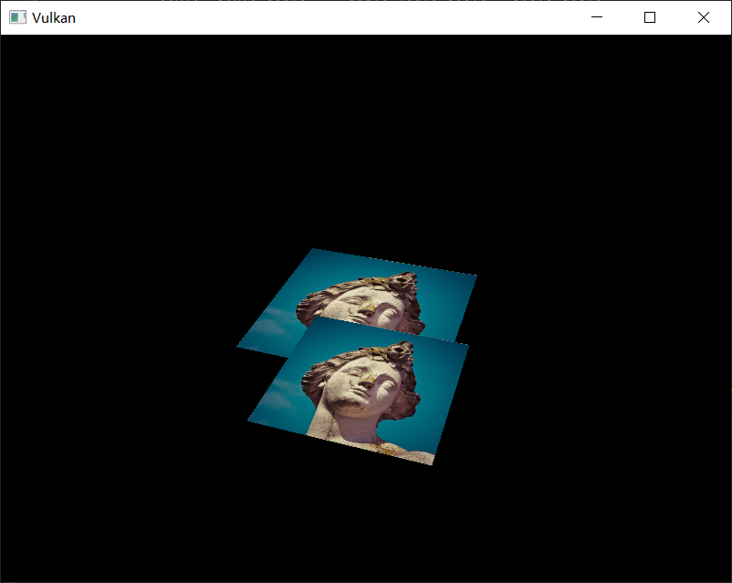
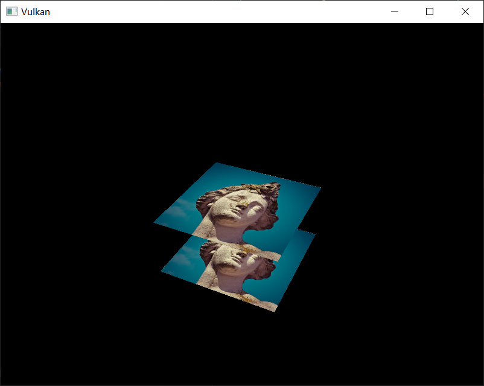

# Depth buffering

## Introduction

The geometry we've worked with so far is projected into 3D, but it's still completely flat. In this chapter we're going to add a Z coordinate to the position to prepare for 3D meshes. We'll use this third coordinate to place a square over the current square to see a problem that arises when geometry is not sorted by depth.

## 3D geometry

Change the `VERTICES` array to use a 3D vector for the position:

```java
private static final float[] VERTICES = {
        // vec3 pos           // vec3 color       // vec2 texCoord
        -0.5f, -0.5f, 0.0f,   1.0f, 0.0f, 0.0f,   1.0f, 0.0f,
        0.5f, -0.5f, 0.0f,    0.0f, 1.0f, 0.0f,   0.0f, 0.0f,
        0.5f, 0.5f, 0.0f,     0.0f, 0.0f, 1.0f,   0.0f, 1.0f,
        -0.5f, 0.5f, 0.0f,    1.0f, 1.0f, 1.0f,   1.0f, 1.0f
};
```

Also change the `VkVertexInputBindingDescription` and `VkVertexInputAttributeDescription` to reflect the new vertex format:

```java
private static VkVertexInputBindingDescription getBindingDescription(Arena arena) {
    var description = VkVertexInputBindingDescription.allocate(arena);
    description.binding(0);
    description.stride(Float.BYTES * 8);
    description.inputRate(VkVertexInputRate.VK_VERTEX_INPUT_RATE_VERTEX);
    return description;
}

private static VkVertexInputAttributeDescription[] getAttributeDescriptions(Arena arena) {
    var attributeDescriptions = VkVertexInputAttributeDescription.allocate(arena, 3);

    attributeDescriptions[0].binding(0);
    attributeDescriptions[0].location(0);
    attributeDescriptions[0].format(VkFormat.VK_FORMAT_R32G32B32_SFLOAT);
    attributeDescriptions[0].offset(0);

    attributeDescriptions[1].binding(0);
    attributeDescriptions[1].location(1);
    attributeDescriptions[1].format(VkFormat.VK_FORMAT_R32G32B32_SFLOAT);
    attributeDescriptions[1].offset(Float.BYTES * 3);

    attributeDescriptions[2].binding(0);
    attributeDescriptions[2].location(2);
    attributeDescriptions[2].format(VkFormat.VK_FORMAT_R32G32_SFLOAT);
    attributeDescriptions[2].offset(Float.BYTES * 6);

    return attributeDescriptions;
}
```

Next, update the vertex shader to accept and transform 3D coordinates as input. Don't forget to recompile it afterwards!

```java
layout(location = 0) in vec3 inPosition;

// ...

void main() {
    gl_Position = ubo.proj * ubo.view * ubo.model * vec4(inPosition, 1.0);
    fragColor = inColor;
    fragTexCoord = inTexCoord;
}
```

If you run your application now, then you should see exactly the same result as before. It's time to add some extra geometry to make the scene more interesting, and to demonstrate the problem that we're going to tackle in this chapter. Duplicate the vertices to define positions for a square right under the current one like this:


Use Z coordinates of `-0.5f` and add the appropriate indices for the extra square:

```java
private static final float[] VERTICES = {
        // vec3 pos            // vec3 color       // vec2 texCoord
        -0.5f, -0.5f, 0.0f,    1.0f, 0.0f, 0.0f,   1.0f, 0.0f,
        0.5f, -0.5f, 0.0f,     0.0f, 1.0f, 0.0f,   0.0f, 0.0f,
        0.5f, 0.5f, 0.0f,      0.0f, 0.0f, 1.0f,   0.0f, 1.0f,
        -0.5f, 0.5f, 0.0f,     1.0f, 1.0f, 1.0f,   1.0f, 1.0f,

        -0.5f, -0.5f, -0.5f,   1.0f, 0.0f, 0.0f,   1.0f, 0.0f,
        0.5f, -0.5f, -0.5f,    0.0f, 1.0f, 0.0f,   0.0f, 0.0f,
        0.5f, 0.5f, -0.5f,     0.0f, 0.0f, 1.0f,   0.0f, 1.0f,
        -0.5f, 0.5f, -0.5f,    1.0f, 1.0f, 1.0f,   1.0f, 1.0f
};
private static final short[] INDICES = {
        0, 1, 2,
        2, 3, 0,

        4, 5, 6,
        6, 7, 4
};
```

Run your program now, and you'll see something resembling an Escher illustration:



The problem is that the fragments of the lower square are drawn over the fragments of the upper square, simply because it comes later in the index array. There are two ways to solve this:

- Sort all the draw calls by depth from back to front
- Use depth testing with a depth buffer

The first approach is commonly used for drawing transparent objects, because order-independent transparency is a difficult challenge to solve. However, the problem of ordering fragments by depth is much more commonly solved using a *depth buffer*. A depth buffer is an additional attachment that stores the depth for every position, just like the color attachment stores the color of every position. Every time the rasterizer produces a fragment, the depth test will check if the new fragment is closer than the previous one. If it isn't, then the new fragment is discarded. A fragment that passes the depth test writes its own depth to the depth buffer. It is possible to manipulate this value from the fragment shader, just like you can manipulate the color output.

## Depth image and view

A depth attachment is based on an image, just like the color attachment. The difference is that the swap chain will not automatically create depth images for us. We only need a single depth image, because only one draw operation is running at once. The depth image will again require the trifecta of resources: image, memory and image view.

```java
private VkImage depthImage;
private VkDeviceMemory depthImageMemory;
private VkImageView depthImageView;
```

Create a new function `createDepthResources` to set up these resources:

```java
private void initVulkan() {
    // ...
    createCommandPool();
    createDepthResources();
    createTextureImage();
    // ...
}

// ...

private void createDepthResources() {
}
```

Creating a depth image is fairly straightforward. It should have the same resolution as the color attachment, defined by the swap chain extent, an image usage appropriate for a depth attachment, optimal tiling and device local memory. The only question is: what is the right format for a depth image? The format must contain a depth component, indicated by` _D??_` in the `VK_FORMAT`_.

Unlike the texture image, we don't necessarily need a specific format, because we won't be directly accessing the texels from the program. It just needs to have a reasonable accuracy, at least 24 bits is common in real-world applications. There are several formats that fit this requirement:


- `VK_FORMAT_D32_SFLOAT`: 32-bit float for depth
- `VK_FORMAT_D32_SFLOAT_S8_UINT`: 32-bit signed float for depth and 8 bit stencil component
- `VK_FORMAT_D24_UNORM_S8_UINT`: 24-bit float for depth and 8 bit stencil component

The stencil component is used for [stencil tests](https://en.wikipedia.org/wiki/Stencil_buffer), which is an additional test that can be combined with depth testing. We'll look at this in a future chapter.

We could simply go for the `VK_FORMAT_D32_SFLOAT` format, because support for it is extremely common (see the hardware database), but it's nice to add some extra flexibility to our application where possible. We're going to write a function `findSupportedFormat` that takes a list of candidate formats in order from most desirable to least desirable, and checks which is the first one that is supported:

```java
private @enumtype(VkFormat.class) int findSupportedFormat(
        @enumtype(VkFormat.class) int[] candidates,
        @enumtype(VkImageTiling.class) int tiling,
        @enumtype(VkFormatFeatureFlags.class) int features
) {
}
```

The support of a format depends on the tiling mode and usage, so we must also include these as parameters. The support of a format can be queried using the `vkGetPhysicalDeviceFormatProperties` function:

```java
for (var format : candidates) {
    try (var arena = Arena.ofConfined()) {
        var props = VkFormatProperties.allocate(arena);
        instanceCommands.vkGetPhysicalDeviceFormatProperties(physicalDevice, format, props);
    }
}
```

The VkFormatProperties struct contains three fields:

- `linearTilingFeatures`: Use cases that are supported with linear tiling
- `optimalTilingFeatures`: Use cases that are supported with optimal tiling
- `bufferFeatures`: Use cases that are supported for buffers

Only the first two are relevant here, and the one we check depends on the `tiling` parameter of the function:

```java
if (tiling == VkImageTiling.VK_IMAGE_TILING_LINEAR && (props.linearTilingFeatures() & features) == features) {
    return format;
}
else if (tiling == VkImageTiling.VK_IMAGE_TILING_OPTIMAL && (props.optimalTilingFeatures() & features) == features) {
    return format;
}
```

If none of the candidate formats support the desired usage, then we can either return a special value or simply throw an exception:

```java
private @enumtype(VkFormat.class) int findSupportedFormat(
        @enumtype(VkFormat.class) int[] candidates,
        @enumtype(VkImageTiling.class) int tiling,
        @enumtype(VkFormatFeatureFlags.class) int features
) {
    for (var format : candidates) {
        try (var arena = Arena.ofConfined()) {
            var props = VkFormatProperties.allocate(arena);
            instanceCommands.vkGetPhysicalDeviceFormatProperties(physicalDevice, format, props);

            if (tiling == VkImageTiling.VK_IMAGE_TILING_LINEAR && (props.linearTilingFeatures() & features) == features) {
                return format;
            }
            else if (tiling == VkImageTiling.VK_IMAGE_TILING_OPTIMAL && (props.optimalTilingFeatures() & features) == features) {
                return format;
            }
        }
    }

    throw new RuntimeException("Failed to find supported format");
}
```

We'll use this function now to create a `findDepthFormat` helper function to select a format with a depth component that supports usage as depth attachment:

```java
private @enumtype(VkFormat.class) int findDepthFormat() {
    return findSupportedFormat(
            new int[] {
                    VkFormat.VK_FORMAT_D32_SFLOAT,
                    VkFormat.VK_FORMAT_D32_SFLOAT_S8_UINT,
                    VkFormat.VK_FORMAT_D24_UNORM_S8_UINT
            },
            VkImageTiling.VK_IMAGE_TILING_OPTIMAL,
            VkFormatFeatureFlags.VK_FORMAT_FEATURE_DEPTH_STENCIL_ATTACHMENT_BIT
    );
}
```

Make sure to use the `VK_FORMAT_FEATURE_` flag instead of `VK_IMAGE_USAGE_` in this case. All of these candidate formats contain a depth component, but the latter two also contain a stencil component. We won't be using that yet, but we do need to take that into account when performing layout transitions on images with these formats. Add a simple helper function that tells us if the chosen depth format contains a stencil component:

```java
private boolean hasStencilComponent(@enumtype(VkFormat.class) int format) {
    return format == VkFormat.VK_FORMAT_D32_SFLOAT_S8_UINT || format == VkFormat.VK_FORMAT_D24_UNORM_S8_UINT;
}
```

Call the function to find a depth format from `createDepthResources`:

```java
var depthFormat = findDepthFormat();
```

We now have all the required information to invoke our `createImage` and `createImageView` helper functions:

```java
var pair = createImage(
        swapChainExtent.width(),
        swapChainExtent.height(),
        depthFormat,
        VkImageTiling.VK_IMAGE_TILING_OPTIMAL,
        VkImageUsageFlags.VK_IMAGE_USAGE_DEPTH_STENCIL_ATTACHMENT_BIT,
        VkMemoryPropertyFlags.VK_MEMORY_PROPERTY_DEVICE_LOCAL_BIT
);
depthImage = pair.first;
depthImageMemory = pair.second;
depthImageView = createImageView(depthImage, depthFormat);
```

However, the createImageView function currently assumes that the subresource is always the `VK_IMAGE_ASPECT_COLOR_BIT`, so we will need to turn that field into a parameter:

```java
private VkImageView createImageView(
        VkImage image,
        @enumtype(VkFormat.class) int format,
        @enumtype(VkImageAspectFlags.class) int aspect
) {
    // ...
    subresourceRange.aspectMask(aspect);
    // ...
}
```

Update all calls to this function to use the right aspect:

```java
swapChainImageViews[i] = createImageView(
        swapChainImages[i],
        swapChainImageFormat,
        VkImageAspectFlags.VK_IMAGE_ASPECT_COLOR_BIT
);

// ...

depthImageView = createImageView(depthImage, depthFormat, VkImageAspectFlags.VK_IMAGE_ASPECT_DEPTH_BIT);

// ...

textureImageView = createImageView(
        textureImage,
        VkFormat.VK_FORMAT_R8G8B8A8_SRGB,
        VkImageAspectFlags.VK_IMAGE_ASPECT_COLOR_BIT
);
```

That's it for creating the depth image. We don't need to map it or copy another image to it, because we're going to clear it at the start of the render pass like the color attachment.

## Explicitly transitioning the depth image

We don't need to explicitly transition the layout of the image to a depth attachment because we'll take care of this in the render pass. However, for completeness I'll still describe the process in this section. You may skip it if you like.

Make a call to `transitionImageLayout` at the end of the `createDepthResources` function like so:

```java
transitionImageLayout(
        depthImage,
        depthFormat,
        VkImageLayout.VK_IMAGE_LAYOUT_UNDEFINED,
        VkImageLayout.VK_IMAGE_LAYOUT_DEPTH_STENCIL_ATTACHMENT_OPTIMAL
);
```

The undefined layout can be used as initial layout, because there are no existing depth image contents that matter. We need to update some of the logic in `transitionImageLayout` to use the right subresource aspect:

```java
if (newLayout == VkImageLayout.VK_IMAGE_LAYOUT_DEPTH_STENCIL_ATTACHMENT_OPTIMAL) {
    subResourceRange.aspectMask(VkImageAspectFlags.VK_IMAGE_ASPECT_DEPTH_BIT);
    if (hasStencilComponent(format)) {
        subResourceRange.aspectMask(subResourceRange.aspectMask()
                                    | VkImageAspectFlags.VK_IMAGE_ASPECT_STENCIL_BIT);
    }
}
else {
    subResourceRange.aspectMask(VkImageAspectFlags.VK_IMAGE_ASPECT_COLOR_BIT);
}
```

Although we're not using the stencil component, we do need to include it in the layout transitions of the depth image.

Finally, add the correct access masks and pipeline stages:

```java
// ...
else if (oldLayout == VkImageLayout.VK_IMAGE_LAYOUT_UNDEFINED
         && newLayout == VkImageLayout.VK_IMAGE_LAYOUT_DEPTH_STENCIL_ATTACHMENT_OPTIMAL) {
    barrier.srcAccessMask(0);
    barrier.dstAccessMask(VkAccessFlags.VK_ACCESS_DEPTH_STENCIL_ATTACHMENT_READ_BIT
                          | VkAccessFlags.VK_ACCESS_DEPTH_STENCIL_ATTACHMENT_WRITE_BIT);

    sourceStage = VkPipelineStageFlags.VK_PIPELINE_STAGE_TOP_OF_PIPE_BIT;
    destinationStage = VkPipelineStageFlags.VK_PIPELINE_STAGE_EARLY_FRAGMENT_TESTS_BIT;
}
// ...
```

The depth buffer will be read from to perform depth tests to see if a fragment is visible, and will be written to when a new fragment is drawn. The reading happens in the `VK_PIPELINE_STAGE_EARLY_FRAGMENT_TESTS_BIT` stage and the writing in the `VK_PIPELINE_STAGE_LATE_FRAGMENT_TESTS_BIT`. You should pick the earliest pipeline stage that matches the specified operations, so that it is ready for usage as depth attachment when it needs to be.

## Render pass

We're now going to modify `createRenderPass` to include a depth attachment. First specify the `VkAttachmentDescription`:

```java
var attachments = VkAttachmentDescription.allocate(arena, 2);
var colorAttachment = attachments[0];
// ...

var depthAttachment = attachments[1];
depthAttachment.format(findDepthFormat());
depthAttachment.samples(VkSampleCountFlags.VK_SAMPLE_COUNT_1_BIT);
depthAttachment.loadOp(VkAttachmentLoadOp.VK_ATTACHMENT_LOAD_OP_CLEAR);
depthAttachment.storeOp(VkAttachmentStoreOp.VK_ATTACHMENT_STORE_OP_DONT_CARE);
depthAttachment.stencilLoadOp(VkAttachmentLoadOp.VK_ATTACHMENT_LOAD_OP_DONT_CARE);
depthAttachment.stencilStoreOp(VkAttachmentStoreOp.VK_ATTACHMENT_STORE_OP_DONT_CARE);
depthAttachment.initialLayout(VkImageLayout.VK_IMAGE_LAYOUT_UNDEFINED);
depthAttachment.finalLayout(VkImageLayout.VK_IMAGE_LAYOUT_DEPTH_STENCIL_ATTACHMENT_OPTIMAL);
```

The `format` should be the same as the depth image itself. This time we don't care about storing the depth data (`storeOp`), because it will not be used after drawing has finished. This may allow the hardware to perform additional optimizations. Just like the color buffer, we don't care about the previous depth contents, so we can use `VK_IMAGE_LAYOUT_UNDEFINED` as `initialLayout`.

```java
var depthAttachmentRef = VkAttachmentReference.allocate(arena);
depthAttachmentRef.attachment(1);
depthAttachmentRef.layout(VkImageLayout.VK_IMAGE_LAYOUT_DEPTH_STENCIL_ATTACHMENT_OPTIMAL);
```

Add a reference to the attachment for the first (and only) subpass:

```java
var subpass = VkSubpassDescription.allocate(arena);
subpass.pipelineBindPoint(VkPipelineBindPoint.VK_PIPELINE_BIND_POINT_GRAPHICS);
subpass.colorAttachmentCount(1);
subpass.pColorAttachments(colorAttachmentRef);
subpass.pDepthStencilAttachment(depthAttachmentRef);
```

Unlike color attachments, a subpass can only use a single depth (+stencil) attachment. It wouldn't really make any sense to do depth tests on multiple buffers.

```java
var renderPassInfo = VkRenderPassCreateInfo.allocate(arena);
renderPassInfo.attachmentCount(2);
renderPassInfo.pAttachments(attachments[0]);
renderPassInfo.subpassCount(1);
renderPassInfo.pSubpasses(subpass);
renderPassInfo.dependencyCount(1);
renderPassInfo.pDependencies(dependency);
```

Next, update the `VkSubpassDependency` struct to refer to both attachments.

```java
var dependency = VkSubpassDependency.allocate(arena);
dependency.srcSubpass(Constants.VK_SUBPASS_EXTERNAL);
dependency.dstSubpass(0);
dependency.srcStageMask(VkPipelineStageFlags.VK_PIPELINE_STAGE_COLOR_ATTACHMENT_OUTPUT_BIT
                        | VkPipelineStageFlags.VK_PIPELINE_STAGE_EARLY_FRAGMENT_TESTS_BIT);
dependency.srcAccessMask(0);
dependency.dstStageMask(VkPipelineStageFlags.VK_PIPELINE_STAGE_COLOR_ATTACHMENT_OUTPUT_BIT
                        | VkPipelineStageFlags.VK_PIPELINE_STAGE_EARLY_FRAGMENT_TESTS_BIT);
dependency.dstAccessMask(VkAccessFlags.VK_ACCESS_COLOR_ATTACHMENT_WRITE_BIT
                         | VkAccessFlags.VK_ACCESS_DEPTH_STENCIL_ATTACHMENT_WRITE_BIT);
```

Finally, we need to extend our subpass dependencies to make sure that there is no conflict between the transitioning of the depth image and it being cleared as part of its load operation. The depth image is first accessed in the early fragment test pipeline stage and because we have a load operation that *clears*, we should specify the access mask for writes.

## Framebuffer

The next step is to modify the framebuffer creation to bind the depth image to the depth attachment. Go to `createFramebuffers` and specify the depth image view as second attachment:

```java
var pAttachments = VkImageView.Buffer.allocate(arena, 2);
pAttachments.write(0, swapChainImageViews[i]);
pAttachments.write(1, depthImageView);

var framebufferInfo = VkFramebufferCreateInfo.allocate(arena);
framebufferInfo.renderPass(renderPass);
framebufferInfo.attachmentCount(2);
framebufferInfo.pAttachments(pAttachments);
framebufferInfo.width(swapChainExtent.width());
framebufferInfo.height(swapChainExtent.height());
framebufferInfo.layers(1);
```

The color attachment differs for every swap chain image, but the same depth image can be used by all of them because only a single subpass is running at the same time due to our semaphores.

You'll also need to move the call to `createFramebuffers` to make sure that it is called after the depth image view has actually been created:

```java
private void initVulkan() {
    // ...
    createDepthResources();
    createFramebuffers();
    // ...
}
```

## Clear values

Because we now have multiple attachments with VK_ATTACHMENT_LOAD_OP_CLEAR, we also need to specify multiple clear values. Go to `recordCommandBuffer` and create an array of `VkClearValue` structs:

```java
var pClearValue = VkClearValue.allocate(arena, 2);
pClearValue[0].color().float32().write(0, 0.0f);
pClearValue[0].color().float32().write(1, 0.0f);
pClearValue[0].color().float32().write(2, 0.0f);
pClearValue[0].color().float32().write(3, 1.0f);
pClearValue[1].depthStencil().depth(1.0f);
pClearValue[1].depthStencil().stencil(0);
renderPassInfo.clearValueCount(2);
renderPassInfo.pClearValues(pClearValue[0]);
```

The range of depths in the depth buffer is `0.0` to `1.0` in Vulkan, where `1.0` lies at the far view plane and `0.0` at the near view plane. The initial value at each point in the depth buffer should be the furthest possible depth, which is `1.0`.

Note that the order of `clearValues` should be identical to the order of your attachments.

## Depth and stencil state

The depth attachment is ready to be used now, but depth testing still needs to be enabled in the graphics pipeline. It is configured through the `VkPipelineDepthStencilStateCreateInfo` struct:

```java
var depthStencil = VkPipelineDepthStencilStateCreateInfo.allocate(arena);
depthStencil.depthTestEnable(Constants.VK_TRUE);
depthStencil.depthWriteEnable(Constants.VK_TRUE);
```

The `depthTestEnable` field specifies if the depth of new fragments should be compared to the depth buffer to see if they should be discarded. The `depthWriteEnable` field specifies if the new depth of fragments that pass the depth test should actually be written to the depth buffer.

```java
depthStencil.depthCompareOp(VkCompareOp.VK_COMPARE_OP_LESS);
```

The `depthCompareOp` field specifies the comparison that is performed to keep or discard fragments. We're sticking to the convention of lower depth = closer, so the depth of new fragments should be *less*.

```java
depthStencil.depthBoundsTestEnable(Constants.VK_FALSE);
depthStencil.minDepthBounds(0.0f); // Optional
depthStencil.maxDepthBounds(1.0f); // Optional
```

The `depthBoundsTestEnable`, `minDepthBounds` and `maxDepthBounds` fields are used for the optional depth bound test. Basically, this allows you to only keep fragments that fall within the specified depth range. We won't be using this functionality.

```java
depthStencil.stencilTestEnable(Constants.VK_FALSE);
```

The last field configures stencil buffer operations, which we also won't be using in this tutorial. If you want to use these operations, then you will have to make sure that the format of the depth/stencil image contains a stencil component.

```java
pipelineInfo.pDepthStencilState(depthStencil);
```

Update the `VkGraphicsPipelineCreateInfo` struct to reference the depth stencil state we just filled in. A depth stencil state must always be specified if the render pass contains a depth stencil attachment.

If you run your program now, then you should see that the fragments of the geometry are now correctly ordered:



## Handling window resize

The resolution of the depth buffer should change when the window is resized to match the new color attachment resolution. Extend the `recreateSwapChain` function to recreate the depth resources in that case:

```java
private void recreateSwapChain() {
    try (var arena = Arena.ofConfined()) {
        var pWidth = IntBuffer.allocate(arena);
        var pHeight = IntBuffer.allocate(arena);
        glfw.glfwGetFramebufferSize(window, pWidth, pHeight);
        while (pWidth.read() == 0 || pHeight.read() == 0) {
            glfw.glfwGetFramebufferSize(window, pWidth, pHeight);
            glfw.glfwWaitEvents();
        }
    }

    deviceCommands.vkDeviceWaitIdle(device);

    cleanupSwapChain();

    createSwapchain();
    createImageViews();
    createDepthResources();
    createFramebuffers();
}
```

The cleanup operations should happen in the swap chain `cleanup` function:

```java
private void cleanupSwapChain() {
    deviceCommands.vkDestroyImageView(device, depthImageView, null);
    deviceCommands.vkDestroyImage(device, depthImage, null);
    deviceCommands.vkFreeMemory(device, depthImageMemory, null);

    // ...
}
```

Congratulations, your application is now finally ready to render arbitrary 3D geometry and have it look right. We're going to try this out in the next chapter by drawing a textured model!
