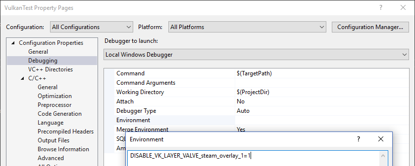

# FAQ

This page lists solutions to common problems that you may encounter while developing Vulkan applications.

<!-- 
TODO: macOS
* **_(macOS)_ I installed the Vulkan SDK, but I get an error about `libvulkan.dylib` not being found when I run a Vulkan application** - see the [`Setup Environment` section of the Vulkan SDK setup instructions for macOS](./development-environment.md#setup-environment)
-->

* **I get an access violation error in the core validation layer** &ndash; Make sure that MSI Afterburner / RivaTuner Statistics Server is not running, because it has some compatibility problems with Vulkan.

* **I don't see any messages from the validation layers / Validation layers are not available** &ndash; First make sure that the validation layers get a chance to print errors by keeping the terminal open after your program exits. You can do this from Visual Studio by running your program with Ctrl-F5 instead of F5, and on Linux by executing your program from a terminal window. If there are still no messages and you are sure that validation layers are turned on, then you should ensure that your Vulkan SDK is correctly installed by following the "Verify the Installation" instructions [on this page](https://vulkan.lunarg.com/doc/view/1.2.135.0/windows/getting_started.html). Also ensure that your SDK version is at least 1.1.106.0 to support the `VK_LAYER_KHRONOS_validation` layer.

* **vkCreateSwapchainKHR triggers an error in SteamOverlayVulkanLayer64.dll** &ndash; This appears to be a compatibility problem in the Steam client beta. There are a few possible workarounds:
  * Opt out of the Steam beta program.
  * Set the `DISABLE_VK_LAYER_VALVE_steam_overlay_1` environment variable to `1`
  * Delete the Steam overlay Vulkan layer entry in the registry under `HKEY_LOCAL_MACHINE\SOFTWARE\Khronos\Vulkan\ImplicitLayers`

Example:

