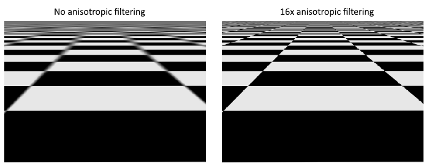

# Image view and sampler

In this chapter we're going to create two more resources that are needed for the graphics pipeline to sample an image. The first resource is one that we've already seen before while working with the swap chain images, but the second one is new - it relates to how the shader will read texels from the image.

## Texture image view

We've seen before, with the swap chain images and the framebuffer, that images are accessed through image views rather than directly. We will also need to create such an image view for the texture image.

Add a class member to hold a `VkImageView` for the texture image and create a new function `createTextureImageView` where we'll create it:

```java
private VkImageView textureImageView;

// ...

private void initVulkan() {
    // ...
    createTextureImage();
    createTextureImageView();
    // ...
}

private void createTextureImageView() {
}
```

The code for this function can be based directly on `createImageViews`. The only two changes you have to make are the format and the image:

```java
var viewInfo = VkImageViewCreateInfo.allocate(arena);
viewInfo.image(textureImage);
viewInfo.viewType(VkImageViewType.VK_IMAGE_VIEW_TYPE_2D);
viewInfo.format(VkFormat.VK_FORMAT_R8G8B8A8_SRGB);
var subresourceRange = viewInfo.subresourceRange();
subresourceRange.aspectMask(VkImageAspectFlags.VK_IMAGE_ASPECT_COLOR_BIT);
subresourceRange.baseMipLevel(0);
subresourceRange.levelCount(1);
subresourceRange.baseArrayLayer(0);
subresourceRange.layerCount(1);
```

I've left out the explicit `viewInfo.components` initialization, because `VK_COMPONENT_SWIZZLE_IDENTITY` is defined as `0` anyway. Finish creating the image view by calling `vkCreateImageView`:

```java
var pImageView = VkImageView.Buffer.allocate(arena);
var result = deviceCommands.vkCreateImageView(device, viewInfo, null, pImageView);
if (result != VkResult.VK_SUCCESS) {
    throw new RuntimeException("Failed to create texture image view, vulkan error code: " + VkResult.explain(result));
}
textureImageView = pImageView.read();
```

Because so much of the logic is duplicated from `createImageViews`, you may wish to abstract it into a new `createImageView` function:

```java
private VkImageView createImageView(VkImage image, @enumtype(VkFormat.class) int format) {
    try (var arena = Arena.ofConfined()) {
        var viewInfo = VkImageViewCreateInfo.allocate(arena);
        viewInfo.image(image);
        viewInfo.viewType(VkImageViewType.VK_IMAGE_VIEW_TYPE_2D);
        viewInfo.format(format);

        var subresourceRange = viewInfo.subresourceRange();
        subresourceRange.aspectMask(VkImageAspectFlags.VK_IMAGE_ASPECT_COLOR_BIT);
        subresourceRange.baseMipLevel(0);
        subresourceRange.levelCount(1);
        subresourceRange.baseArrayLayer(0);
        subresourceRange.layerCount(1);

        var pImageView = VkImageView.Buffer.allocate(arena);
        var result = deviceCommands.vkCreateImageView(device, viewInfo, null, pImageView);
        if (result != VkResult.VK_SUCCESS) {
            throw new RuntimeException("Failed to create image view, vulkan error code: " + VkResult.explain(result));
        }
        return pImageView.read();
    }
}
```

The `createTextureImageView` function can now be simplified to:

```java
private void createTextureImageView() {
    textureImageView = createImageView(textureImage, VkFormat.VK_FORMAT_R8G8B8A8_SRGB);
}
```

And `createImageViews` can be simplified to:

```java
private void createImageViews() {
    swapChainImageViews = new VkImageView[swapChainImages.length];
    for (int i = 0; i < swapChainImages.length; i++) {
        swapChainImageViews[i] = createImageView(swapChainImages[i], swapChainImageFormat);
    }
}
```

Make sure to destroy the image view at the end of the program, right before destroying the image itself:

```java
private void cleanup() {
    // ...
    deviceCommands.vkDestroyImageView(device, textureImageView, null);
    deviceCommands.vkDestroyImage(device, textureImage, null);
    // ...
}
```

## Samplers

It is possible for shaders to read texels directly from images, but that is not very common when they are used as textures. Textures are usually accessed through samplers, which will apply filtering and transformations to compute the final color that is retrieved.

These filters are helpful to deal with problems like oversampling. Consider a texture that is mapped to geometry with more fragments than texels. If you simply took the closest texel for the texture coordinate in each fragment, then you would get a result like the first image:


If you combined the 4 closest texels through linear interpolation, then you would get a smoother result like the one on the right. Of course your application may have art style requirements that fit the left style more (think Minecraft), but the right is preferred in conventional graphics applications. A sampler object automatically applies this filtering for you when reading a color from the texture.

Under sampling is the opposite problem, where you have more texels than fragments. This will lead to artifacts when sampling high frequency patterns like a checkerboard texture at a sharp angle:



As shown in the left image, the texture turns into a blurry mess in the distance. The solution to this is [anisotropic filtering](https://en.wikipedia.org/wiki/Anisotropic_filtering), which can also be applied automatically by a sampler.

Aside from these filters, a sampler can also take care of transformations. It determines what happens when you try to read texels outside the image through its *addressing mode*. The image below displays some of the possibilities:


We will now create a function `createTextureSampler` to set up such a sampler object. We'll be using that sampler to read colors from the texture in the shader later on.

```java
private void initVulkan() {
    // ...
    createTextureImage();
    createTextureImageView();
    createTextureSampler();
    // ...
}

// ...

private void createTextureSampler() {
}
```

Samplers are configured through a `VkSamplerCreateInfo` structure, which specifies all filters and transformations that it should apply.

```java
try (var arena = Arena.ofConfined()) {
    var samplerInfo = VkSamplerCreateInfo.allocate(arena);
    samplerInfo.magFilter(VkFilter.VK_FILTER_LINEAR);
    samplerInfo.minFilter(VkFilter.VK_FILTER_LINEAR);
}
```

The `magFilter` and `minFilter` fields specify how to interpolate texels that are magnified or minified. Magnification concerns the oversampling problem describes above, and minification concerns undersampling. The choices are `VK_FILTER_NEAREST` and `VK_FILTER_LINEAR`, corresponding to the modes demonstrated in the images above.

```java
samplerInfo.addressModeU(VkSamplerAddressMode.VK_SAMPLER_ADDRESS_MODE_REPEAT);
samplerInfo.addressModeV(VkSamplerAddressMode.VK_SAMPLER_ADDRESS_MODE_REPEAT);
samplerInfo.addressModeW(VkSamplerAddressMode.VK_SAMPLER_ADDRESS_MODE_REPEAT);
```

The addressing mode can be specified per axis using the `addressMode` fields. The available values are listed below. Most of these are demonstrated in the image above. Note that the axes are called U, V and W instead of X, Y and Z. This is a convention for texture space coordinates.

- `VK_SAMPLER_ADDRESS_MODE_REPEAT`: Repeat the texture when going beyond the image dimensions.
- `VK_SAMPLER_ADDRESS_MODE_MIRRORED_REPEAT`: Like repeat, but inverts the coordinates to mirror the image when going beyond the dimensions.
- `VK_SAMPLER_ADDRESS_MODE_CLAMP_TO_EDGE`: Take the color of the edge closest to the coordinate beyond the image dimensions.
- `VK_SAMPLER_ADDRESS_MODE_MIRROR_CLAMP_TO_EDGE`: Like clamp to edge, but instead uses the edge opposite to the closest edge.
- `VK_SAMPLER_ADDRESS_MODE_CLAMP_TO_BORDER`: Return a solid color when sampling beyond the dimensions of the image.
                              
It doesn't really matter which addressing mode we use here, because we're not going to sample outside of the image in this tutorial. However, the repeat mode is probably the most common mode, because it can be used to tile textures like floors and walls.
                                                                       
```java
samplerInfo.anisotropyEnable(Constants.VK_TRUE);
samplerInfo.maxAnisotropy(/* ???*/);
```

These two fields specify if anisotropic filtering should be used. There is no reason not to use this unless performance is a concern. The `maxAnisotropy` field limits the amount of texel samples that can be used to calculate the final color. A lower value results in better performance, but lower quality results. To figure out which value we can use, we need to retrieve the properties of the physical device like so:

```java
var properties = VkPhysicalDeviceProperties.allocate(arena);
instanceCommands.vkGetPhysicalDeviceProperties(physicalDevice, properties);
```

If you look at the documentation for the `VkPhysicalDeviceProperties` structure, you'll see that it contains a `VkPhysicalDeviceLimits` member named limits. This struct in turn has a member called `maxSamplerAnisotropy` and this is the maximum value we can specify for `maxAnisotropy`. If we want to go for maximum quality, we can simply use that value directly:

```java
samplerInfo.maxAnisotropy(properties.limits().maxSamplerAnisotropy());
```

You can either query the properties at the beginning of your program and pass them around to the functions that need them, or query them in the `createTextureSampler` function itself.

```java
samplerInfo.borderColor(VkBorderColor.VK_BORDER_COLOR_INT_OPAQUE_BLACK);
```

The `borderColor` field specifies which color is returned when sampling beyond the image with clamp to border addressing mode. It is possible to return black, white or transparent in either float or int formats. You cannot specify an arbitrary color.

```java
samplerInfo.unnormalizedCoordinates(Constants.VK_FALSE);
```

The `unnormalizedCoordinates` field specifies which coordinate system you want to use to address texels in an image. If this field is `VK_TRUE`, then you can simply use coordinates within the `[0, texWidth)` and `[0, texHeight)` range. If it is `VK_FALSE`, then the texels are addressed using the `[0, 1)` range on all axes. Real-world applications almost always use normalized coordinates, because then it's possible to use textures of varying resolutions with the exact same coordinates.

```java
samplerInfo.compareEnable(Constants.VK_FALSE);
samplerInfo.compareOp(VkCompareOp.VK_COMPARE_OP_ALWAYS);
```

If a comparison function is enabled, then texels will first be compared to a value, and the result of that comparison is used in filtering operations. This is mainly used for percentage-closer filtering on shadow maps. We'll look at this in a future chapter.

```java
samplerInfo.mipmapMode(VkSamplerMipmapMode.VK_SAMPLER_MIPMAP_MODE_LINEAR);
samplerInfo.mipLodBias(0.0f);
samplerInfo.minLod(0.0f);
samplerInfo.maxLod(0.0f);
```

All of these fields apply to mipmapping. We will look at mipmapping in a later chapter, but basically it's another type of filter that can be applied.

The functioning of the sampler is now fully defined. Add a class member to hold the handle of the sampler object and create the sampler with `vkCreateSampler`:

```java
private VkSampler textureSampler;

// ...

var pSampler = VkSampler.Buffer.allocate(arena);
var result = deviceCommands.vkCreateSampler(device, samplerInfo, null, pSampler);
if (result != VkResult.VK_SUCCESS) {
    throw new RuntimeException("Failed to create texture sampler, vulkan error code: " + VkResult.explain(result));
}
textureSampler = pSampler.read();
```

Note the sampler does not reference a `VkImage` anywhere. The sampler is a distinct object that provides an interface to extract colors from a texture. It can be applied to any image you want, whether it is 1D, 2D or 3D. This is different from many older APIs, which combined texture images and filtering into a single state.

Destroy the sampler at the end of the program when we'll no longer be accessing the image:

```java
private void cleanup() {
    // ...
    deviceCommands.vkDestroySampler(device, textureSampler, null);
    deviceCommands.vkDestroyImageView(device, textureImageView, null);
    // ...
}
```

## Anisotropy device feature

If you run your program right now, you'll see a validation layer message like this:

```
Validation layer: Validation Error: [ VUID-VkSamplerCreateInfo-anisotropyEnable-01070 ] Object 0: handle = 0x1f8c82e62e0, type = VK_OBJECT_TYPE_DEVICE; | MessageID = 0x56f192bc | vkCreateSampler(): Anisotropic sampling feature is not enabled, pCreateInfo->anisotropyEnable must be VK_FALSE. The Vulkan spec states: If the samplerAnisotropy feature is not enabled, anisotropyEnable must be VK_FALSE (https://vulkan.lunarg.com/doc/view/1.3.250.0/windows/1.3-extensions/vkspec.html#VUID-VkSamplerCreateInfo-anisotropyEnable-01070)
```

That's because anisotropic filtering is actually an optional device feature. We need to update the `createLogicalDevice` function to request it:

```java
var deviceFeatures = VkPhysicalDeviceFeatures.allocate(arena);
deviceFeatures.samplerAnisotropy(Constants.VK_TRUE);
```

And even though it is very unlikely that a modern graphics card will not support it, we should update `isDeviceSuitable` to check if it is available:

```java
var supportedFeatures = VkPhysicalDeviceFeatures.allocate(arena);
instanceCommands.vkGetPhysicalDeviceFeatures(device, supportedFeatures);
return swapChainSupport.formats().length != 0
       && swapChainSupport.presentModes().size() != 0
       && supportedFeatures.samplerAnisotropy() == Constants.VK_TRUE;
```

The `vkGetPhysicalDeviceFeatures` repurposes the `VkPhysicalDeviceFeatures` struct to indicate which features are supported rather than requested by setting the boolean values.

Instead of enforcing the availability of anisotropic filtering, it's also possible to simply not use it by conditionally setting:

```java
samplerInfo.anisotropyEnable(Constants.VK_FALSE);
samplerInfo.maxAnisotropy(1.0f);
```

In the next chapter we will expose the image and sampler objects to the shaders to draw the texture onto the square.
