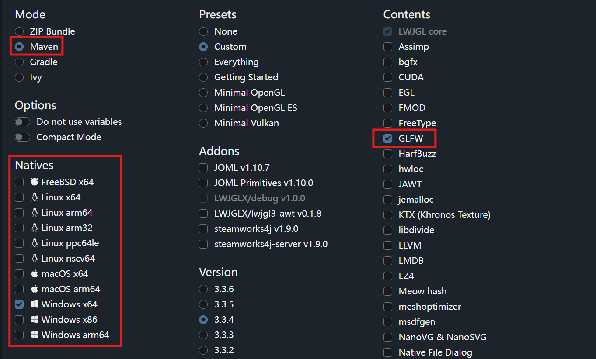
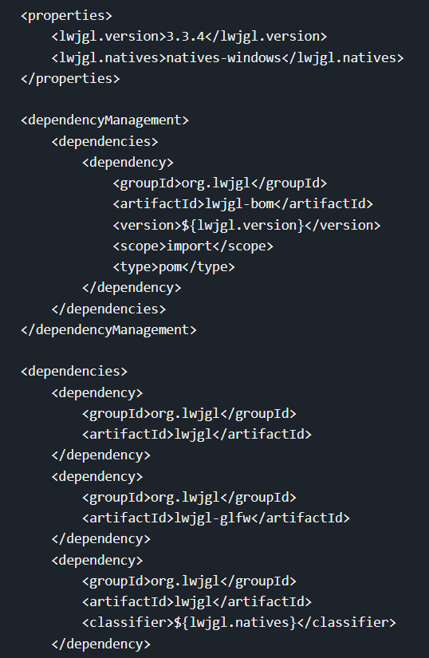
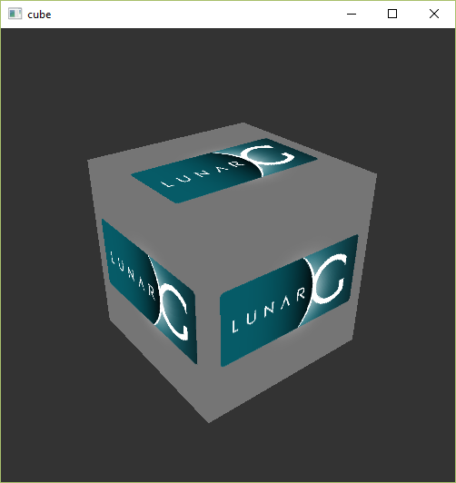

# Development environment

> [C++ version](https://vulkan-tutorial.com/Development_environment)

In this chapter we'll set up your environment for developing Vulkan applications by installing the Vulkan SDK for your operating system. This tutorial assumes you already have a working Java development environment.

## Maven project

Create a Maven project and add the following dependencies to your `pom.xml` file:

```xml
<dependency>
    <groupId>club.doki7</groupId>
    <artifactId>ffm-plus</artifactId>
    <version>0.2.0</version>
</dependency>
<dependency>
    <groupId>club.doki7</groupId>
    <artifactId>vulkan</artifactId>
    <version>0.3.1</version>
</dependency>
<dependency>
    <groupId>club.doki7</groupId>
    <artifactId>glfw</artifactId>
    <version>0.3.1</version>
</dependency>
<dependency>
    <groupId>org.joml</groupId>
    <artifactId>joml</artifactId>
    <version>1.10.8</version>
</dependency>
<dependency>
    <groupId>de.javagl</groupId>
    <artifactId>obj</artifactId>
    <version>0.4.0</version>
</dependency>
```

`club.doki7.vulkan` is the Vulkan binding for Java, `club.doki7.ffm-plus` is a library that provides a thin wrapper over the Java 22 FFM APIs to make them easier and more type-safe to use. `club.doki7.glfw` is a Java binding for the GLFW library, which we'll use for window creation. `org.joml` is a math library that we'll use for vector and matrix operations. `de.javagl.obj` is a library for loading Wavefront OBJ files, which we'll use for loading 3D models.

## GLFW

Unlike `lwjgl-glfw` and other Java bindings for GLFW, `club.doki7.glfw` does not come up with the native binaries.

> Chuigda did not bundle the native libraries with `club.doki7.glfw` because he doesn't know what's the best practice in Java world, <del>definitely not because he's lazy</del>. If you have a good idea, a pull request is always welcome.

### Setup it on yourself

To setup GLFW on yourself, you need to download the GLFW binaries for your operating system and architecture, either from the [official website](https://www.glfw.org/download.html), or using your favorite package manager.

If you're using a package manager, all things should be set up for you automatically. However, if you're downloading the binaries manually, you'll need a bit more effort to make JVM find the native libraries. There are two ways to do this:

- Copy (or link) the native library file (`glfw3.dll`) to some directory that is included by `PATH` environment variable.
- Set the `java.library.path` system property to the directory containing the native libraries. This can be done by adding the following line to JVM arguments: `-Djava.library.path=/path/to/glfw/native/libs`. If you're using IDEs, you can usually set this in the run configuration. Consult your IDE documentation for more information.

In realworld production you may want to bundle the native libraries with your application (usually a JAR file), in that case you may use some solution like [native-utils](https://github.com/adamheinrich/native-utils).

### Using `lwjgl-natives`

LWJGL comes with a handy bundle of native library binaries, which can also be used by `vulkan4j`. The setup is a little bit tricky, but also helps avoiding some complications.

Open the [Customize LWJGL](https://www.lwjgl.org/customize) page, choose Maven mode, and pick natives from the left column according to your need. Select only `GLFW` from contents. After doing these, the web page may look like such:



And you will get your Maven configuration below:



Copy the configuration to your project's `pom.xml`, but remove the `org.lwjgl.lwjgl-glfw` dependency: we only need the native binaries and library loader provided by LWJGL, not the GLFW wrapper. The content you need to copy may look like:

```xml
<properties>
    <lwjgl.version>3.3.4</lwjgl.version>
</properties>

<profiles>
    <!-- your selected profiles here -->
</profiles>

<dependencyManagement>
    <dependencies>
        <dependency>
            <groupId>org.lwjgl</groupId>
            <artifactId>lwjgl-bom</artifactId>
            <version>${lwjgl.version}</version>
            <scope>import</scope>
            <type>pom</type>
        </dependency>
    </dependencies>
</dependencyManagement>

<dependencies>
    <dependency>
        <groupId>org.lwjgl</groupId>
        <artifactId>lwjgl</artifactId>
    </dependency>
    <dependency>
        <groupId>org.lwjgl</groupId>
        <artifactId>lwjgl</artifactId>
        <classifier>${lwjgl.natives}</classifier>
    </dependency>
    <dependency>
        <groupId>org.lwjgl</groupId>
        <artifactId>lwjgl-glfw</artifactId>
        <classifier>${lwjgl.natives}</classifier>
    </dependency>
</dependencies>
```

Then you can load GLFW from `lwjgl-natives`. We'll come back to this topic in the [Base code](./01-setup/instance.md) chapter.

## Vulkan SDK

The most important component you'll need for developing Vulkan applications is the SDK. It includes the headers, standard validation layers, debugging tools and a loader for the Vulkan functions. The loader looks up the functions in the driver at runtime, similarly to GLEW for OpenGL - if you're familiar with that.

### Windows

The SDK can be downloaded from the [LunarG website](https://vulkan.lunarg.com/) using the buttons at the bottom of the page. You don't have to create an account, but it will give you access to some additional documentation that may be useful to you.


Proceed through the installation and pay attention to the installation location of the SDK. The first thing we'll do is verify that your graphics card and driver properly support Vulkan. Go to the directory where you installed the SDK, open the `Bin` directory and run the `vkcube.exe` demo. You should see the following:



If you receive an error message then ensure that your drivers are up-to-date, include the Vulkan runtime and that your graphics card is supported. See the [introduction chapter](introduction.md) for links to drivers from the major vendors.

There is another program in this directory that will be useful for development. The `glslangValidator.exe` and `glslc.exe` programs will be used to compile shaders from the human-readable [GLSL](https://en.wikipedia.org/wiki/OpenGL_Shading_Language) to bytecode. We'll cover this in depth in the [shader modules chapter](pipeline/ch09-shader-modules.md). The `Bin` directory also contains the binaries of the Vulkan loader and the validation layers, while the `Lib` directory contains the libraries.

Feel free to explore the other files, but we won't need them for this tutorial.

### Linux

These instructions will be aimed at Ubuntu users, but you may be able to follow along by changing the `apt` commands to the package manager commands that are appropriate for you.

The most important components you'll need for developing Vulkan applications on Linux are the Vulkan loader, validation layers, and a couple of command-line utilities to test whether your machine is Vulkan-capable:

* `sudo apt install vulkan-tools` &ndash; Command-line utilities, most importantly `vulkaninfo` and `vkcube`. Run these to confirm your machine supports Vulkan.
* `sudo apt install libvulkan-dev` &ndash; Installs Vulkan loader. The loader looks up the functions in the driver at runtime, similarly to GLEW for OpenGL - if you're familiar with that.
* `sudo apt install vulkan-validationlayers-dev` &ndash; Installs the standard validation layers. These are crucial when debugging Vulkan applications, and we'll discuss them in an upcoming chapter.

If installation was successful, you should be all set with the Vulkan portion. Remember to run `vkcube` and ensure you see the following pop up in a window:


If you receive an error message then ensure that your drivers are up-to-date, include the Vulkan runtime and that your graphics card is supported. See the [introduction chapter](introduction.md) for links to drivers from the major vendors.

### macOS

> TODO: Author does not use macOS and cannot provide instructions. If you have reproducible instructions for macOS, please submit a pull request. 
